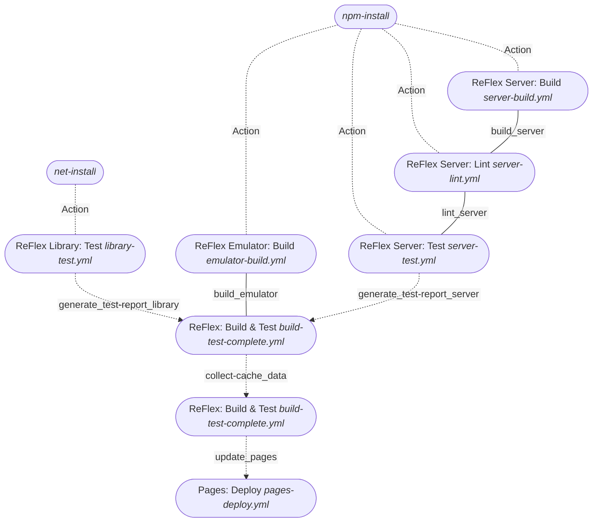

# ReFlex: github CI

<!-- omit in toc -->

## Table of Contents

1. [Table of Contents](#table-of-contents)
2. [Workflows](#workflows)
3. [Pull Request (main)](#pull-request-main)

## Workflows

| File                                 | Name                                     | Description                                                  | PR    | Push | Release | call | manual |
| ------------------------------------ | ---------------------------------------- | ------------------------------------------------------------ | ----- | ---- | ------- | ---- | ------ |
| `build-test-complete-with-pages.yml` | ReFlex: Build, Test & Deploy Pages       | Build and test Library and Server, and generate reports      |       | X`*` |         |      | X      |
| `cache-cleanup.yml`                  | Cleanup PR Caches                        | Cleanup caches created for PR when PR is closed              | X`**` |      |         |      |        |
| `emulator-build.yml`                 | ReFlex Emulator: Build                   | Build Emulator App                                           |       |      |         | X    | X      |
| `emulator-release.yml`               | ReFlex Emulator: Publish (Win)           | Create Emulator Electron App as release                      |       |      | X       |      |        |
| `library-test.yml`                   | ReFlex Library: Test                     | Build and Test Library (.NET) [`ReFlex.sln`] with reports    |       |      | X       | X    |        |
| `net-build-all.yml`                  | ReFlex: Build, Test .NET Solution        | Build and Test Library (.NET) [`ReFlex.sln`] without reports | X     |      |         |      | X      |
| `npm-build-all.yml`                  | ReFlex: Build/Lint/Test all npm projects | Build, lit, test all projects in npm workspace               | X     |      |         |      | X      |
| `pages-deploy.yml`                   | Pages: Deploy                            | Deploy Documentation with test reports restored from Cache   |       | X    |         |      | X      |
| `server-build.yml`                   | ReFlex Server: Build                     | Build Server (Angular)                                       |       |      |         | X    | X      |
| `server-lint.yml`                    | ReFlex Server: Lint                      | Run Linter for Server (Angular)                              |       |      |         | X    | X      |
| `server-release.yml`                 | ReFlex Server: Publish (Win)             | Create Server Electron App as release                        |       |      | X       |      |        |
| `server-test.yml`                    | ReFlex Server: Test                      | Test Server (Angular)                                        |       |      |         | X    | X      |
| `shared-build.yml`                   | ReFlex Shared Types: Build               | Build Shared Types Lib (Typescript)                          |       | X`*` |         |      | X      |
| `shared-components-build.yml`        | ReFlex Shared Types: Build               | Build Shared Types Lib (Typescript)                          |       | X`*` |         |      | X      |

`*` push to main branch
`**` when PR is closed

**[⬆ back to top](#table-of-contents)**

## Pull Request (main)

Workflows to be run:

- [ReFlex: Build & Test](#reflex-build--test-build-test-completeyml)
- Cleanup PR Caches
- ReFlex Emulator: Build
- ReFlex Library: Build, ReFlex Library: Test (triggered by [ReFlex: Build & Test](#reflex-build--test-build-test-completeyml))
- ReFlex Server: Build
- ReFlex Server: Lint
- ReFlex Server: Test
- ReFlex Shared Types: Build

### ReFlex: Build & Test (build-test-complete.yml)

Composite workflow that:

- Builds and tests ReFlex Library
- Builds, lints and tests ReFlex Server
- Builds Emulator
- Collects Reports for Server and Library (`generate_test-report_server` / `generate_test-report_library`)
- Saves these reports in Cache `test-reports`
- deploys github pages (`update_pages`)

### Pages: Deploy (pages-deploy.yml)

- collects test report from cache `test-reports`
- **REMARKS** Caches for github actions are scoped to the current branch (or `main` branch). this means that cached reports created on a feature branch or PR are not restored. Instead, in this case the last cache created on `main` branch is retrieved. This should not be an issue, as by default, commits / PRs for `pages` should not contain changes to documentation. However, after merging a PR that changed the documentation, the updated documentation is only retrieved from cache when `Pages: Deploy` runs **AFTER** `ReFlex: Build & Test`. As this order is not enforced, it might be necessary to manually trigger `Pages: Deploy` on `main` afterwards to update pages with the new version of the documentation
- copies readme files from repository to `docs` (using `scripts/copy_docs.sh`)
- builds page with jekyll
- deploy github page artifact

### Cleanup PR Caches

When creating a PR and running checks, the caches created during these workflow runs are only valid when PR is updated. As Caches are scoped to that current PR branch, these caches are not longer useful for other workflow runs. This workflow deletes these cache automatically, to free up space.
More information: [github Documentation](https://docs.github.com/en/actions/using-workflows/caching-dependencies-to-speed-up-workflows#force-deleting-cache-entries)

**[⬆ back to top](#table-of-contents)**
