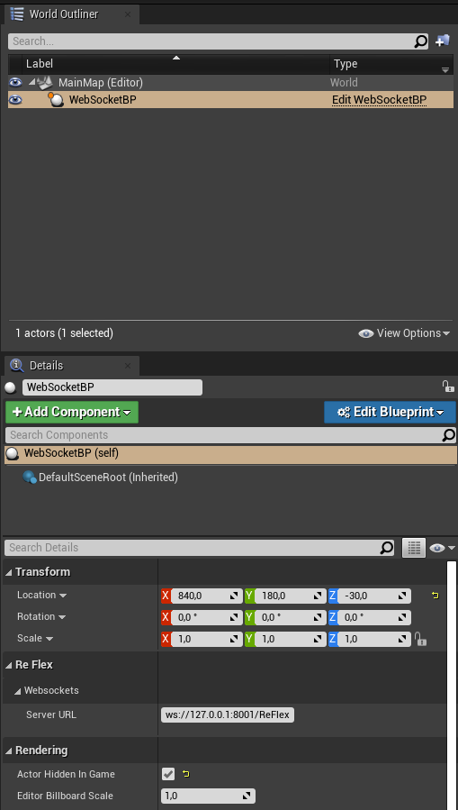

# UE4_WebSockets

Example Project for connecting __Unreal Engine__ with __ReFlex WebSocket__ events.

Plugin for using ReFlex with Unreal Engine using WebSockets

## Requirements

* Unreal Engine 4.27
* Editor (recommended): JetBrains Rider 2023.1.2

## Keyboard Shortcuts

| Key   | Action              |
| ----- | ------------------- |
| `S`   | Toggle Settings     |
| `D`   | Toggle Debug Canvas |
| `Esc` | Exit application    |

## Basic Components

* Interactions are provided as Blueprint Type `DepthInteraction` with Properties:
  * TouchId
  * Position (X,Y,Z, IsValid, IsFiltered)
  * Confidence
  * Type (deprecated)
  * ExtremumDescription (Type, NumFittingPoints, PercentageFittingPoints)
  * Time

* Position coordinates are normalized to range [0,1] for X,Y and [-1,1] for Z.
* X and Y coordinates are relative to the registered viewport, meaning a Value of [0.5, 1] in a viewport of dimension 800 x 600 with top-margin of 50 pixel and left margin of 75 pixel refer to the device coordinates [450, 875]. Viewport and margins need to match values provided to TrackingServer configuration.

### UE4_WebSockets/Blueprint/BP_WebSocket

* Actor for Connecting / Disconnecting to WebSockets
* fires `ConnectionStateChanged` event, if Connection State has changed (connected / closed / error)
* fires `InteractionsUpdated` event when Interactions are received

### UE4_WebSockets/Interface/IWebSocketObserver

* basic interface for registering websocket actor (from level BP or so) with another Blueprint to get access to BP_WebSocket an attach to events

### UE4_WebSockets/UI/WebSocketState

* userWidget containing information about connection State
* implements `IWebSocketObserver` interface which exposes `RegisterWebSocket` method
* need reference to BP_WebSocket after initialization --> see [Add Widgets To Screen](#add-widgets-to-screen)
* also show current settings, and lets the user store the settings

## HowTo

### Connect to websockets

* simply drag BP_WebSocket in your level (or attach to your Character / GameMode / ...)
* subscribe to events to get informed about updates
  


### implement your own logic / components

* create a Blueprint that implements `IWebSocketObserver` interface
* register WebSocket from level blueprint
* in `RegisterWebsocket` event:
  * store Websocket as local variable
  * subscribe to `InteractionsUpdated` event and/or `ConnectionStateChanged` Event


* you can refer to event graphs of `WebSocketState` and `DebugCanvas` to see how to extract interactions

### Add Widgets to Screen

* `WebSocketState` and `DebugCanvas` implement `IWebSocketObersver` --> register BP_WebSocket


* Widgets need to be added to screen to get initialized properly; but can be removed afterwards if they should be hidden


### Create own Blueprint Actor using ReFlex WebSockets

* simply create a Blueprint class deriving from `ReFlexWebSocketConnection`
* functions:

| Name                    | Type                         | Description                                            |
| ----------------------- | ---------------------------- | ------------------------------------------------------ |
| ServerURL               | FString                      | Sets the URL to ReFlex server Websocket connection     |
| Serializer              | MessageSerializer (ReadOnly) | Extracts DepthInteractions from ReFlex Server messages |
| ConnectToWebSocket      | Method                       | Establishes the connection                             |
| DisconnectFromWebSocket | Method                       | Closes the connection                                  |
| ConnectionClosed        | Event                        | Triggered when connection is closed                    |
| ConnectionError         | Event                        | Triggered when connection detects an error             |
| ConnectionSuccessful    | Event                        | Triggered when connection is opened                    |
| MessageReceived         | Event                        | Triggered when websocket receives data                 |

## Troubleshooting

* Building / Packaging sometimes fails with Error: `fatal error C1076: compiler limit: internal heap limit reached; use /Zm to specify a higher limit` or `error C3859: virtual memory range for PCH exceeded; please recompile with a command line option of ‘-Zm98’ or greater` 
  * close other running programs may already solve the issue
  * Delete the following folder inside the Game folder:
    * `Binaries`
    * `Build`
    * `DerivedDataCache`
    * `Intermediate`
    * `Saved`
    * and the Visual Studio Solution File `UE4_WebSockets.sln`
  * right click on the UE project file --> `Generate Visual Studio project files`

* When creating your own game module, the packaged game crashes directly after start
  * first: build in Development config to enable logging (logs can be found in `Saved/Logs`)
  * one issue could be that WebSocketsModule is not loaded by default, therefore this needs to be done *before* `BeginPlay`, e.g. in Moulde: StartupModule:

  ``` C++
    #include "Modules/ModuleManager.h"

    ...

    void FYourModule::StartupModule()
    {
      // Put your module initialization code here

      if(!FModuleManager::Get().IsModuleLoaded("WebSockets"))
      {
        FModuleManager::Get().LoadModule("WebSockets");
      }
    }
  ```
