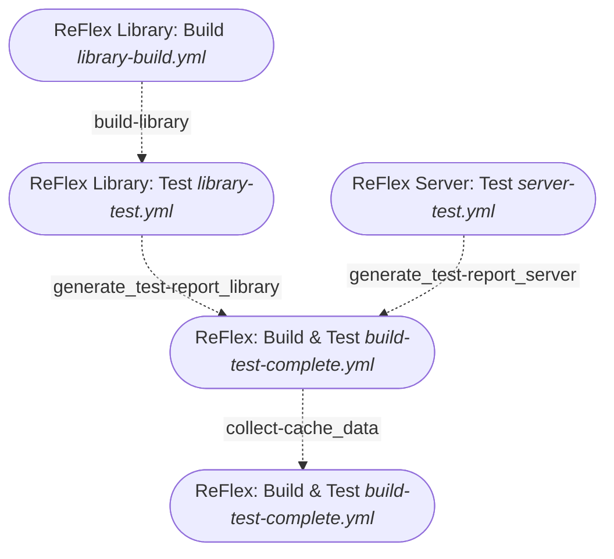

# ReFlex

Software Development SDK for __Elastic Displays__ as open source mono repo

* .NET Core library as framework for different depth sensors, calibration, depth image filtering and reconstruction of interactions
* APS.NET Core / Angular server application as frontend for library
* can be packaged as electron app for desktop
* Example client applications for Plain HTML, Angular, React, Vue.js, Plugins for Unity, Unreal Engine 5
* Emulator as Development Tool
* Example Applications

<!-- omit in toc -->
## Table of contents

1. [Repository structure](#repository-structure)
2. [External Dependencies](#external-dependencies)
3. [use shared code](#use-shared-code)
4. [ReFlex.TrackingServer](#reflextrackingserver)
5. [Emulator](#emulator)
6. [Python gRPC Processing service](#python-grpc-processing-service)
7. [CI](#ci)
8. [Known issues](#known-issues)

## Repository structure

| Directory  | Content                                                                                       |
| ---------- | --------------------------------------------------------------------------------------------- |
| `apps`     | Applications using the `ReFlex` framework                                                     |
| `design`   | Design / Graphic source files                                                                 |
| `docs`     | documentation for github pages                                                                |
| `examples` | Templates and Plugins (`Angular`, `Vue.js`, `React`, `Unreal Engine 5`, `Unity`. `.NET`)      |
| `external` | Place for external libraries, if needed (see [External Dependencies](#external-dependencies)) |
| `library`  | `ReFlex` .NET library                                                                         |
| `packages` | Shared Typescript code between applications (see (#use-shared-code))                          |
| `services` | Micro services for extending server capabilities                                              |
| `test`     | Test projects, test artifacts, `Insomnia` workspace                                           |
| `tools`    | Developer Tools and Server application                                                        |

__[⬆ back to top](#table-of-contents)__

### NPM workspaces

The repository uses NPM workspaces for better management of dependencies

Therefore, the repository should be initialized in the root folder by running the command `npm install` and not in the sub directories (although there are package.json files, but these files are just handling the local dependencies)

__[⬆ back to top](#table-of-contents)__

### Repository initialization

* copy [ExternalDependencies](#external-dependencies) into `external`
* run `npm run build:shared-types` to build shared types library
* run `npm install` in root directory
* if building with electron: Install Electron-Builder globally by running: `npm install electron -g`

__[⬆ back to top](#table-of-contents)__

### Development

* Adding a new workspace: `npm init -w ./path/to/workspace/directory`
* Adding packages to workspace: `npm install -w ./path/to/workspace/directory package --save` (in workspace root directory)

__[⬆ back to top](#table-of-contents)__

## External Dependencies

* The following dlls need to be placed in the `external` directory for use with the associated depth cameras
* __Intel RealSense R2/D435/L515__ `Intel.Realsense.dll`, `libpxcclr.cs.dll`, `libpxccpp2c.dll`, `realsense2.dll` from [Intel RealSense SDK](https://github.com/IntelRealSense/librealsense/releases)
* __Microsoft Kinect__ `Microsoft.Kinect.dll`, `Microsoft.Kinect.xml` from [Microsoft Kinect for Windows SDK 2.0](https://www.microsoft.com/en-us/download/details.aspx?id=44561)
* if the sensors listed above are not relevant; the .NET solution can be built using the preprocessor flag `NO_EXTERNAL_SENSORS` by using one of the following methods:
  * `dotnet build ReFlex.sln -c CI` (use Solution Configuration `CI` which includes the definition of the mentioned Constant)
  * edit `ReFlex.sln` and change the line `<DefineAdditionalConstants/>` to `<DefineAdditionalConstants>NO_EXTERNAL_SENSORS</DefineAdditionalConstants>`

__[⬆ back to top](#table-of-contents)__

## use shared code

* for using `reflex-shared-types` in another project, just install it as workspace dependency in the current project, e.g. `npm install ./packages/reflex-shared-types -w ./tools/ReFlex.TrackingServer/ClientApp --save`
* types are available by importing `@reflex/shared-types`

__[⬆ back to top](#table-of-contents)__

## ReFlex.TrackingServer

* Build TrackingServer: run `npm run build:electron-win` / `npm run build:electron-osx` / `npm run build:electron-linux` (OSX can only be built in macOS)
  
* see [ReFlex.TrackingServer readme](tools/ReFlex.TrackingServer/readme.md)

__[⬆ back to top](#table-of-contents)__

## Emulator

* Electron seems not to be perfectly suitable to be used in monorepos, as building the app in the package process removes all dev dependencies, including the electron-.builder package if installed locally  
  Therefore, `electron-builder` neds to be installed globally before executing the `build:emulator:electron-win` script
* Additionally, `npm install` is executed after packaging to restore the dev dependencies
* if the script `build:electron-win` is executed from within the emulator project, `npm install` has to be executed manually afterwards

__[⬆ back to top](#table-of-contents)__

## Python gRPC Processing service

* as an example for integrating external services, a python gRPC service for extracting interactions from the camera depth image is provided in `services/python-backend`
* service is consumed when setting Interaction Processor to `Remote`
* in the `ReFlex.TrackingServer`, the service is configured in `Services/RemoteInteractionProcessingService.cs`
* Documentation: [Python gRPC service](services/python-backend/README.md)

__[⬆ back to top](#table-of-contents)__

## CI

| File                      | Name                           | Description                                                | PR  | Push | Release | reusable | manual |
| ------------------------- | ------------------------------ | ---------------------------------------------------------- | --- | ---- | ------- | -------- | ------ |
| `build-test-complete.yml` | ReFlex: Build & Test           | Build and test Library and Server, and generate reports    | X   | X    |         |          | X      |
| `cache-cleanup.yml`       | Cleanup PR Caches              | Cleanup caches created for PR when PR is closed            | X   |      |         |          |        |
| `emulator-build.yml`      | ReFlex Emulator: Build         | Build Emulator App                                         | X   | X    |         |          |        |
| `emulator-release.yml`    | ReFlex Emulator: Publish (Win) | Create Emulator Electron App as release                    |     |      | X       |          |        |
| `library-build.yml`       | ReFlex Library: Build          | Build Library (.NET)                                       |     |      |         | X        |      |
| `library-test.yml`        | ReFlex Library: Test           | Build and Test Library (.NET)                              |     |      |         | X        |       |
| `pages-deploy.yml`        | Pages: Deploy                  | Deploy Documentation with test reports restored from Cache |     | X    |         |          | X      |
| `server-build.yml`        | ReFlex Server: Build           | Build Server (Angular)                                     | X   | X    |         |          |       |
| `server-lint.yml`         | ReFlex Server: Lint            | Run Linter for Server (Angular)                            | X   | X    |         |          |       |
| `server-release.yml`      | ReFlex Server: Publish (Win)   | Create Server Electron App as release                      |     |      | X       |          |        |
| `server-test.yml`         | ReFlex Server: Test            | Test Server (Angular)                                      | X   | X    |         |          |       |
| `shared-test.yml`         | ReFlex Shared Types: Build     | Build Shared Types Lib (Typescript)                        | X   | X    |         | X        |        |

### Pull Request (main)

Workflows to be run:

* [ReFlex: Build & Test](#reflex-build--test-build-test-completeyml)
* Cleanup PR Caches
* ReFlex Emulator: Build
* ReFlex Library: Build, ReFlex Library: Test (triggered by [ReFlex: Build & Test](#reflex-build--test-build-test-completeyml))
* ReFlex Server: Build
* ReFlex Server: Lint
* ReFlex Server: Test
* ReFlex Shared Types: Build

#### ReFlex: Build & Test (build-test-complete.yml)

Composite workflow that:

* Builds and tests ReFlex Library
* Builds and tests ReFlex Server
* Collects Reports for Server ans Library
* Saves these reports in Cache `test-reports`

Prerequisite step for `Pages: Deploy`

#### Pages: Deploy (pages-deploy.yml)

* collects test report from cache `test-reports`
* __REMARKS__ Caches for github actions are scoped to the current branch (or `main` branch). this means that cached reports created on a feature branch or PR are not restored. Instead, in this case the last cache created on `main` branch is retrieved. This should not be an issue, as by default, commits / PRs for `pages` should not contain changes to documentation. However, after merging a PR that changed the documentation, the updated documentation is only retrieved from cache when `Pages: Deploy` runs __AFTER__ `ReFlex: Build & Test`. As this order is not enforced, it might be necessary to manually trigger `Pages: Deploy` on `main` afterwards to update pages with the new version of the documentation
* copies readme files from repository to `docs` (using `scripts/copy_docs.sh`)
* builds page with jekyll
* deploy github page artifact

#### Cleanup PR Caches

When creating a PR and running checks, the caches created during these workflow runs are only valid when PR is updated. As Caches are scoped to that current PR branch, these caches are not longer useful for other workflow runs. This workflow deletes these cache automatically, to free up space.
More information: [github Documentation](https://docs.github.com/en/actions/using-workflows/caching-dependencies-to-speed-up-workflows#force-deleting-cache-entries)

__[⬆ back to top](#table-of-contents)__

## Known issues

* `Karma Test Explorer` Plugin for vs code does not work well with the current npm workspace setup, as it does not identify the correct angular path. In order to use the plugin, the global angular installation is used as fallback.
* if the application behaves different when executing the packaged electron version (either installed using the setup or the executable in the `win-unpacked directory)`), this may be caused by outdated Electron Cache. In this case, open `%AppData%` Folder (Windows) and delete the folder `reflex.trackingserver`

__[⬆ back to top](#table-of-contents)__
